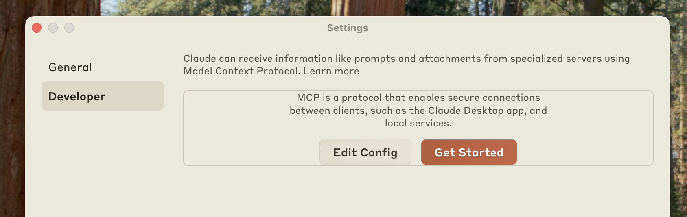

# decision-mcp-server MCP Server

## What is IBM ODM?

IBM Operational Decision Manager (ODM) is a business rules management system that helps organizations automate, manage, and govern business decisions. ODM allows you to define, deploy, and update decision logic outside of application code, making your business more agile and responsive.

## Why Connect MCP Server to IBM ODM?

The Model Context Protocol (MCP) server acts as a bridge between IBM ODM and modern AI assistants or orchestration platforms. By connecting MCP to ODM Decision Server Runtime, you can:
- Expose decision services as tools and prompts for AI assistants
- Enable dynamic decision automation in workflows
- Simplify integration with Watson Orchestrate and other platforms
- Centralize business logic and make it accessible to end users and bots

## Features

- **Decision Storage**: Demonstrates resource management with a local storage system
- **Tools**: Add  and invoke ODM decision services as tools

## Quickstart

### Prerequisites

- Python 3.13+
- Docker 
- [Watson Orchestrate ADK](https://developer.watson-orchestrate.ibm.com/getting_started/installing)

### Installation in Watson Orchestrate ADK Integration

#### **Clone the repository**

   ```bash
   git clone <repo-url>
   cd decision-mcp-server
   ```


#### To use this MCP server as a Watson Orchestrate tool:

1. **Install Watson Orchestrate ADK**

   Follow the [official guide](https://developer.watson-orchestrate.ibm.com/getting_started/installing).

2. Run the [Operational Decison Manager for Developers image](https://hub.docker.com/r/ibmcom/odm)

```bash
docker run -e LICENSE=accept --network wxo-server -p 9060:9060 -p 9443:9443 --name odm -e SAMPLE=true icr.io/cpopen/odm-k8s/odm:9.5
```
3. **Import the sample material**

- Open the Decision Server Console [Decision Server Console](https://localhost:9060/res)
* Login - odmAdmin / odmAdmin
* Click Explorer
* Deploy button
* Select the file in `<DIRECTORY>/samples/hr_ruleapps.jar`
* Click Deploy button

4. **Register the MCP Server**

  Use the Waston orchestrate command line 
```bash
orchestrate toolkits import  --kind mcp  --name DecisionServer --description "A MCP IBM Decision Server" --package-root $PWD  --command "uv run decision-mcp-server --odm-url=http://odm:9060/res"
```
This should return something like that
```
[INFO] - ✅ The following tools will be imported:
  • vacation
[INFO] - Successfully imported tool kit DecisionServer
```


> Notes: 
> - If you have issue to import the mcp server verify you have not .venv directory. If so remove it by using `rm -R .venv`

5. **Use Waston Orchestrate with ODM**

   * Start the Watson Orchestrate Chat UI 
```
orchestrate chat start
```

   * Click `Create a new Agent`
      - Name : Decision Agent
      - Description : A Decisional Agent
    Click `Create` button

   * Click `Manage Agents`
   * Select the `Decision Agent`
   * Click Toolset
   * Click `Add tools`
   * Click Add from Local instance
   * Check `DecisionServer:vacation`
   * Click `Add Agents` button


Now we are ready to use this agent.
Select the Decision Agent chat 

Then ask this question :
`
John Doe is an Acme Corp employee who was hired on November 1st, 1999. How many vacation days is John Doe entitled to each year?
`
This should return 
```
John Doe is entitled to 43 days per year.
```

### Installation in Claude Desktop

#### Prerequisites for Claude Desktop

- Python 3.13+
- [uv](https://docs.astral.sh/uv/getting-started/installation/)
- [Rancher Docker](https://rancherdesktop.io/) - [Optional if you will used ODM deployed on Kubernetes]
- [Claude Desktop ](https://claude.ai/download)

#### Check the pre-requisites :
- Check uv and Python 

```shell
uv python list

...
cpython-3.13.3-macos-aarch64-none                   /opt/homebrew/opt/python@3.13/bin/python3.13 -> ../Frameworks/Python.framework/Versions/3.13/bin/python3.13
```

- Check docker installation (Optional if you will used ODM deployed on Kubernetes)
```shell
docker search ibmcom/odm

NAME                                                 DESCRIPTION                                     STARS     OFFICIAL
ibmcom/odm                                           Official IBM Operational Decision Manager fo…   31
...
```

#### Register the MCP Decision Server in Claude Desktop 
1. Open Claude Desktop Settings
Start by accessing the Claude Desktop settings. Click on the Claude menu in your system’s menu bar (not the settings within the Claude window itself) and select “Settings…”On macOS, this appears in the top menu bar.

2. Access Developer Settings

In the Settings window, navigate to the “Developer” tab in the left sidebar. This section contains options for configuring MCP servers and other developer features.

Click the “Edit Config” button to open the configuration file:



Developer settings showing Edit Config button
This action creates a new configuration file if one doesn’t exist, or opens your existing configuration. 

The file is located at:

  *  macOS: ~/Library/Application Support/Claude/claude_desktop_config.json
  *  Windows: %APPDATA%\Claude\claude_desktop_config.json

3. Configure the  `decision-mcp-server` Server

Replace the contents of the configuration file with the following JSON structure. This configuration tells Claude Desktop to start the Decison MCP Server with access:

  ```json
  {
    "mcpServers": {
      "decision-mcp-server": {
        "command": "uvx",
        "args": [
          "--from",
          "git+https://github.com/DecisionsDev/decision-mcp-server",
          "decision-mcp-server"
        ]
      }
    }
  }
  ```

4. Restart Claude Desktop


For more informations on how to extend Claude Desktop with local MCP servers see the [MCP Documentation](https://modelcontextprotocol.io/quickstart/user)

## Support

For more details on IBM ODM, see [IBM Documentation](https://www.ibm.com/docs/en/odm).
For Watson Orchestrate ADK, see [Getting Started](https://developer.watson-orchestrate.ibm.com/getting_started/installing).


## ✅ Development Checklist (By Priority)

- [x] **Support configuration via CLI and environment variables**  
      Allow configuration of the MCP server (host, port, etc.) through command-line arguments and environment variables.

- [ ] **Verify Zen authentication support**  
      Ensure compatibility with IBM Zen-based authentication flows.

- [ ] **Support multiple Decision Server endpoints**  
      Verify connection when the Decision Server Console and Runtime are hosted on different URLs.

- [x] **Test and document Claude Desktop integration**  
      Ensure compatibility with Claude Desktop and provide integration instructions.

- [ ] **Record demo video for Claude Desktop integration**  
      Capture a short video showcasing the MCP server in action with Claude Desktop.

- [x] **Test  Cursor AI integration**  

- [ ] **Document the integration process**

- [ ] **Record demo video for Cursor AI integration**  
      Capture a short walkthrough of Cursor AI usage with the MCP server.

- [ ] **Implement Notification Context**  
      Add support for the MCP `notification` context to handle asynchronous updates or events.

- [ ] **Store and expose Decision Trace executions as MCP resources**  
      Persist decision traces and make them available as MCP resources for querying or analysis.

- [ ] **Verify OpenID Connect authentication**  
      Confirm proper behavior with OIDC identity providers and document setup.
