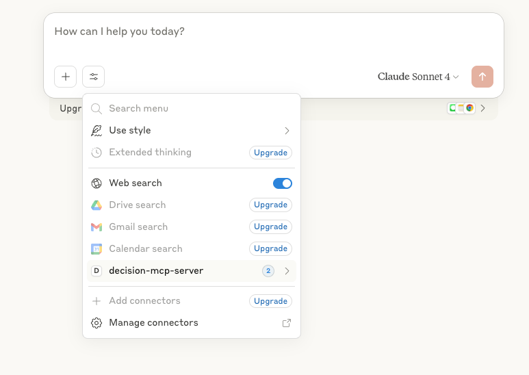

# Decision MCP Server Documentation

## Overview

The Decision MCP Server bridges IBM ODM with modern AI assistants and orchestration platforms.  
It enables you to:
- Expose decision services as tools for AI assistants
- Automate decisions dynamically in workflows
- Integrate easily with Watson Orchestrate, Claude Desktop, and Cursor AI
- Centralize and expose business logic to end users and bots

---

## Features

- **Tool Integration:** Add and invoke ODM decision services as tools
- **Decision Storage:** Manage resources with a local storage system
- **Authentication:** Zen API Key, Basic Auth, and OpenID Connect
- **Multi-Platform:** Works with Watson Orchestrate, Claude Desktop, and Cursor AI

---

## Quickstart: Claude Desktop Integration

### Part 1: Installation & Configuration

#### Prerequisites

- Python 3.11+
- [uv](https://docs.astral.sh/uv/getting-started/installation/)
- Claude Desktop ([Download](https://claude.ai/download))
- Docker (optional, for local ODM deployment)

#### Step 1: Install `uv` and Python

Verify your Python and `uv` installation:
```bash
uv python list
```

#### Step 2: Run ODM Locally (Optional)

If you want to use a local ODM instance for development or testing, you can start it using Docker Compose:

```bash
docker-compose up
...
upload_materials  | ✅ ODM Ready for MCP Server
upload_materials exited with code 0
```

Once the containers are running, access the ODM web console at [http://localhost:9060](http://localhost:9060) using the default credentials:

- **Username:** `odmAdmin`
- **Password:** `odmAdmin`

This ODM instance will be available for the MCP Server, pre-populated with sample data for testing and development purposes.

#### Step 3: Configure Claude Desktop
1. Open Claude Desktop Settings:
   - On macOS, click the Claude menu in the top menu bar and select **Settings**.
   - On Windows, access **Settings** from the Claude application.

2. Navigate to the **Developer** tab and click **Edit Config**:
   - macOS: `~/Library/Application Support/Claude/claude_desktop_config.json`
   - Windows: `%APPDATA%\Claude\claude_desktop_config.json`

3. Add the following configuration:
   ```json
   {
     "mcpServers": {
       "decision-mcp-server": {
         "command": "uvx",
         "args": [
           "--from",
           "git+https://github.com/DecisionsDev/decision-mcp-server",
           "decision-mcp-server"
         ]
       }
     }
   }
   ```

4. Restart Claude Desktop.

Refer to the [Parameters Table](#parameters-table) for a list of supported environment variables and CLI arguments.

### Part 2: Demo Walkthrough

This walkthrough demonstrates how Claude Desktop can interact with IBM ODM Developer Edition through the Decision MCP Server. The scenario showcases two decision services:

1. **Vacation Policy Decision Service** – Computes vacation days based on company policy.
2. **Beauty Advice Decision Service** – Provides personalized beauty recommendations.

#### Step-by-Step Scenario

##### 1. Claude Connects to ODM

Once Claude Desktop is configured with the MCP Server, it automatically connects to the ODM Developer Edition. The MCP Server retrieves and exposes the available decision services as Claude tools.

✅ You should see both tools listed in Claude's interface:
- `compute_vacation`
- `beauty_advice`



##### 2. User Starts a Conversation

The user initiates a conversation in Claude with a natural language request:

> **User:** "I need to compute my vacation."

Claude recognizes this intent and activates the `computeVacation` tool.

##### 3. Claude Gathers Required Inputs

Claude prompts the user for the necessary information:

> **Claude:** "Can you provide your employee ID and hiring date?"

The user responds with:

> **User:** "Employee ID: 12345, Hiring Date: 2018-06-01"

##### 4. ODM Decision Service is Invoked

Claude sends the input to the ODM decision service via the MCP Server. The service processes the request and returns a result, such as:

> **ODM Response:** `{  "timeoffDays": "33 days per year" }`

Claude interprets and presents the result:

> **Claude:** "Based on your hiring date, you are entitled to 33 time-off days."

##### 5. User Tries Another Input

The user can experiment with different inputs:

> **User:** "What if I was hired on 2000-01-01?"

Claude reuses the tool, sends the new input, and returns the updated result.

##### 6. Switching to Beauty Advice

The user can now try a different tool:

> **User:** "Can I get some beauty advice?"

Claude activates the `beauty_advice` tool and may ask follow-up questions (e.g., skin type, preferences) before invoking the ODM service and returning personalized recommendations.

#### Demo Notes

- This scenario demonstrates how Claude can dynamically interact with multiple decision services.
- The tools are exposed automatically by the MCP Server based on the ODM configuration.
- You can extend this setup with additional decision services or integrate it into broader workflows using Watson Orchestrate.
- Watch our demo video:

[](https://raw.githubusercontent.com/DecisionsDev/decision-mcp-server/refs/heads/feature/rename_dc_project/docs/Claude.mp4)


## Watson Orchestrate ADK Integration

The Watson Orchestrate ADK integration allows you to connect the Decision MCP Server to Watson Orchestrate for dynamic decision-making workflows.

For detailed instructions, see the [Watson Orchestrate ADK Integration Guide](docs/watson-orchestrate-adk-guide.md).

---


## Configuration


### ODM Container Environments & Authentication

Depending on your IBM ODM deployment, use the appropriate authentication method:

#### 1. **ODM on Cloud Pak for Business Automation**
- **Environment:** Cloud Pak for Business Automation (CP4BA)
- **Authentication:** Zen API Key
- **CLI:** `--zenapikey <your-zen-api-key>`
- **Env:** `ZENAPIKEY=<your-zen-api-key>`

#### 2. **ODM on Kubernetes**
- **Environment:** IBM ODM deployed on Kubernetes (including OpenShift)
- **Authentication:**  
  - **Basic Auth:**  
    - **CLI:** `--username <user> --password <pass>`
    - **Env:** `ODM_USERNAME=<user> ODM_PASSWORD=<pass>`
  - **OpenID Connect (using Client Credentials):**  
    - **CLI:** `--client_id <CLIENT_ID> --client_secret <CLIENT_SECRET> --token_url <TOKEN_URL>` and optionally `--scope <scope>`
    - **Env:** `CLIENT_ID=<client_id> CLIENT_SECRET=<client_secret> TOKEN_URL=<URL>` and optionally `SCOPE=<scope>`

#### 3. **ODM for Developers (Docker/Local)**
- **Environment:** Local Docker or Developer Edition
- **Authentication:** Basic Auth
- **CLI:** `--username <user> --password <pass>`
- **Env:** `ODM_USERNAME=<user> ODM_PASSWORD=<pass>`

---

### Parameters Table

| CLI Argument      | Environment Variable | Description                                                                                            | Default                                 |
|-------------------|---------------------|---------------------------------------------------------------------------------------------------------|-----------------------------------------|
| `--url`           | `ODM_URL`           | URL of the Decision Server console (used for management and deployment operations)                      | `http://localhost:9060/res`             |
| `--runtime-url`   | `ODM_RUNTIME_URL`   | URL of the Decision Server runtime (used for executing decision services)                               | `<ODM_URL>/DecisionService`             |
| `--username`      | `ODM_USERNAME`      | Username for Basic Auth or Zen authentication                                                           | `odmAdmin`                              |
| `--password`      | `ODM_PASSWORD`      | Password for Basic Auth                                                                                 | `odmAdmin`                              |
| `--zenapikey`     | `ZENAPIKEY`         | Zen API Key for authentication with Cloud Pak for Business Automation                                   |                                         |
| `--client_id`     | `CLIENT_ID`         | OpenID Connect client ID for authentication                                                             |                                         |
| `--client_secret` | `CLIENT_SECRET`     | OpenID Connect client secret for authentication                                                         |                                         |
| `--token_url`     | `TOKEN_URL`         | OpenID Connect token endpoint URL for authentication                                                    |                                         |
| `--scope`         | `SCOPE`             | OpenID Connect scope used when requesting an access token using Client Credentials for authentication   | `openid`                                |
| `--verifyssl`     | `VERIFY_SSL`        | Whether to verify SSL certificates (`True` or `False`)                                                  | `True`                                  |
| `--ssl_cert_path` | `SSL_CERT_PATH`     | Path to the SSL certificate file. If not provided, defaults to system certificates.                     |                                         |
| `--log-level`     | `LOG_LEVEL`         | Set the logging level (`DEBUG`, `INFO`, `WARNING`, `ERROR`, `CRITICAL`)                                 | `INFO`                                  |
| `--traces-dir`    | `TRACES_DIR`        | Directory to store execution traces                                                                     | `~/.mcp-server/traces`                  |
| `--trace-enable`  | `TRACE_ENABLE`      | Enable or disable trace storage (`True` or `False`)                                                     | `False`                                 |
| `--trace-maxsize` | `TRACE_MAXSIZE`     | Maximum number of traces to store before removing oldest traces                                          | `50`                                    |
          
### Customizing MCP Server Configuration          

You can configure the MCP server for clients like Claude Desktop or Cursor AI using JSON configuration.  
**You may use both environment variables and command-line arguments. CLI arguments always take precedence.**

#### Recommended: Local Development (Basic Auth)

```json
{
  "mcpServers": {
    "decision-mcp-server": {
      "command": "uvx",
      "args": [
        "--from",
        "git+https://github.com/DecisionsDev/decision-mcp-server",
        "decision-mcp-server",
        "--url", "http://localhost:9060/res",
        "--username", "odmAdmin",
        "--password", "odmAdmin"
      ]
    }
  }
}
```

#### Using Environment Variables

Add an `env` object to your MCP server configuration. Each key-value pair sets an environment variable for the MCP server process:

```json
{
  "mcpServers": {
    "decision-mcp-server": {
      "command": "uvx",
      "args": [
        "--from",
        "git+https://github.com/DecisionsDev/decision-mcp-server",
        "decision-mcp-server"
      ],
      "env": {
        "ODM_URL": "http://localhost:9060/res",
        "ODM_USERNAME": "odmAdmin",
        "ODM_PASSWORD": "odmAdmin"
      }
    }
  }
}
```

#### Using CLI Arguments

Alternatively, pass configuration options directly in the `args` array.  
Each argument is passed to the MCP server as if running from the command line.

```json
{
  "mcpServers": {
    "decision-mcp-server": {
      "command": "uvx",
      "args": [
        "--from",
        "git+https://github.com/DecisionsDev/decision-mcp-server",
        "decision-mcp-server",
        "--url", "https://your-odm-url",
        "--username", "your-username",
        "--password", "your-password"
      ]
    }
  }
}
```

#### For Cloud Pak (Zen API Key)

```json
"args": [
  "--from",
  "git+https://github.com/DecisionsDev/decision-mcp-server",
  "decision-mcp-server",
  "--zenapikey", "YOUR_ZEN_API_KEY","--username","YOUR_ZENUSERNAME"
]
```
or
```json
"env": {
  "ZENAPIKEY": "YOUR_ZEN_API_KEY",
  "USERNAME": "YOUR_ZEN_USERNAME"
}
```

---

**Tips:**
- Use CLI arguments for quick overrides or non-sensitive parameters.
- Use environment variables for secrets.
- You can mix both methods if needed. CLI arguments override environment variables.

> **Recommended:** For local development and testing, use the Basic Auth example above. For production or Cloud Pak deployments, use the Zen API Key or OpenID Connect options as appropriate for your environment.

---

### Ruleset Properties for MCP Configuration

You can configure how your Decision Server rulesets are exposed as MCP tools by setting specific ruleset properties in IBM ODM. These properties control whether a ruleset is available as a tool and how it's presented to AI assistants.

#### Adding Ruleset Properties

You can add ruleset properties using any of these methods:

1. **In Rule Designer:**
   - Open your ruleset project
   - Right-click on the ruleset > Properties > Ruleset Properties
   - Add the desired properties with their values
   - Save and deploy your ruleset

2. **In Decision Center:**
   - Open the ruleset > Settings > Properties
   - Add the desired properties with their values
   - Save and deploy your ruleset

3. **In Decision Server Console:**
   - Log in to the Decision Server Console
   - Navigate to Explorer > Rulesets
   - Select your ruleset
   - Click on the "Properties" tab
   - Add the desired properties with their values
   - Click "Save"

#### MCP Configuration Properties
Property | Description | Default |
|-------------------|--------------------------------------------------------------------------|------------------------------------------|
`agent.enabled`     | Controls whether the ruleset is exposed as an MCP tool                   | `false`                                  |
`agent.name`        | Customizes the name of the tool as exposed to AI assistants              | Name of the decision operation. Display Name in the Decision Server console. |
`agent.description` | Overrides the default description of the ruleset when exposed as a tool  | Description of the decision operation     |

#### Example

```
agent.enabled=true
agent.description=This tool calculates vacation days based on employee tenure and position
```

**Note:** After updating ruleset properties, you need to redeploy the ruleset for changes to take effect.

---

### Fine-Tuning Tool Descriptions for LLMs

When exposing decision services as tools for LLMs, the quality of the tool descriptions significantly impacts how effectively the LLM can utilize them. Here are best practices for optimizing your tool descriptions:

#### Detailed Service Descriptions

Having detailed descriptions of what a service does and the expected parameter values can guide the LLM to be more precise when triggering tools.

##### Example:

```
Allow to compute the beauty advise. This takes as parameters:
- age: should be between 0 and 110
- sex: Value should be Male or Female
- skin color: should be one of these values: Dark, Ebony, Ivory, Light, Medium or Unknown
- hair color: should be one of these values: Black, Blonde, Brown, Gray, Red, White or Unknown

For the hair color or skin color, you can suggest possible values.
```

This detailed description helps the LLM understand:
- The purpose of the service ("compute beauty advice")
- Valid parameter ranges and constraints
- Acceptable enumeration values
- Guidance on how to handle certain parameters

#### Enhancing OpenAPI with Swagger Annotations

When service descriptions alone aren't sufficient to fully describe the API signature, you can augment your OpenAPI generation by adding Swagger annotations to your Java classes:

```java
package miniloan;

import io.swagger.v3.oas.annotations.media.Schema;

/**
 * This class models a borrower.
 * A borrower is created with a name, a credit score, and a yearly income.
 */
@Schema(description = "This class models a borrower. A borrower is created with a name, a credit score, and a yearly income.")
public class Borrower {
    @Schema(description = "The name of the borrower.")
    private String name;
    
    @Schema(description = "The credit score of the borrower.", format = "int32")
    private int creditScore;
    
    @Schema(description = "The yearly income of the borrower.", format = "int32")
    private int yearlyIncome;

    
    public Borrower() {
    }
}
```

These annotations provide:
- Detailed descriptions for each field
- Format specifications
- Additional metadata that can be included in the generated OpenAPI specification

> **Note:** It's not necessary to package the Swagger JAR file in the XOM (Execution Object Model) as it's already part of the IBM ODM product. You can use the annotations directly without adding additional dependencies to your project.

By combining rich service descriptions with properly annotated model classes, you can create tool definitions that LLMs can understand and use with high precision, reducing errors and improving the quality of interactions.

## More informations

- For IBM ODM, see [IBM Documentation](https://www.ibm.com/docs/en/odm).
- For Watson Orchestrate ADK, see [Getting Started](https://developer.watson-orchestrate.ibm.com/getting_started/installing).
- For Claude Desktop, see [Claude Documentation](https://claude.ai/docs).

---

## Development Checklist

- [x] Add sample scenario in the documentation - On going
- [x] Put in place intensive unit-tests with Coverage
- [x] Investigate XOM annotation
- [x] Investigate How to inject description from Decision Center
- [x] Store and expose Decision Trace executions as MCP resources
- [ ] Manage ODM certificate
- [ ] Declare Structured Output
- [x] Decide naming convention prefix for Ruleset properties. (tools -> agent/decisionassistant )
- [x] Verify OpenID Connect authentication
- [ ] Expose a tool to explain decisions
- [x] Record demo video for Claude Desktop integration
- [x] Add a docker-compose to inject to deploy the ruleapps.
- [x] Support configuration via CLI and environment variables
- [x] Verify Zen authentication support
- [x] Support multiple Decision Server endpoints
- [x] Test and document Claude Desktop integration
- [x] Test  Cursor AI integration
- [ ] Implement Notification Context
