# IBM watsonx Orchestrate Integration Guide

## Overview

This page explains how to augment IBM watsonx Orchestrate with decisions implemented in IBM Operational Decision Manager (ODM), or in other words, how to enable watsonx Orchestrate to execute ODM rulesets during a user interaction in a chat.

This integration is possible thanks to the Decision MCP Server, and this page explains how to configure it in IBM watsonx orchestrate.

## Prerequisites

You need a running instance of both:
- [IBM watsonx Orchestrate](https://www.ibm.com/docs/en/watsonx/watson-orchestrate/base)
- IBM Operational Decision Manager

## Configuration

### 1. Create an agent

- Click the main menu icon

   

- Navigate to **Build > Agent Builder**

   

- Navigate to **All agents**,
- Click **Create agent +** to add a new agent. 

   

- Choose **Create from scratch**,
- Enter a **Name** eg. `ODM agent`
- Enter a **Description** eg. `This agent enables to execute ODM rulesets.`
- Click **Create**

   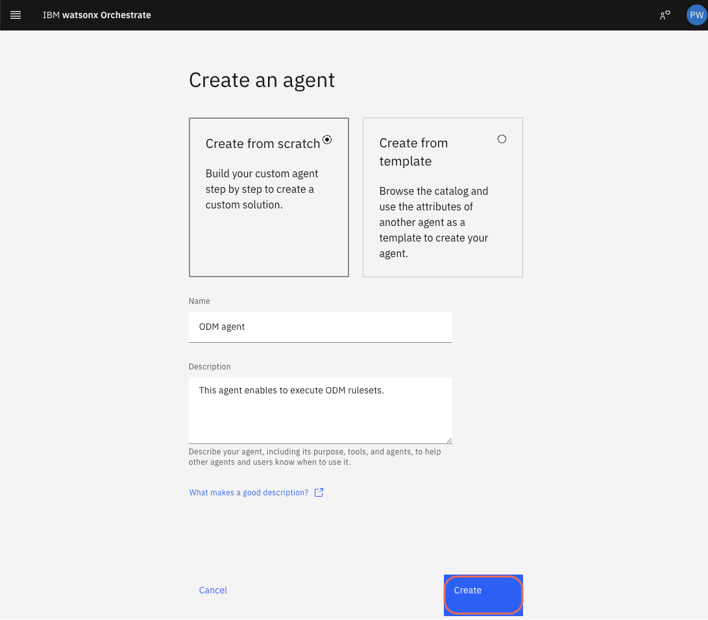

### 2. Augment the agent with an Decision MCP Server

- Navigate to the **Toolset** section, click **Add tool +**.

   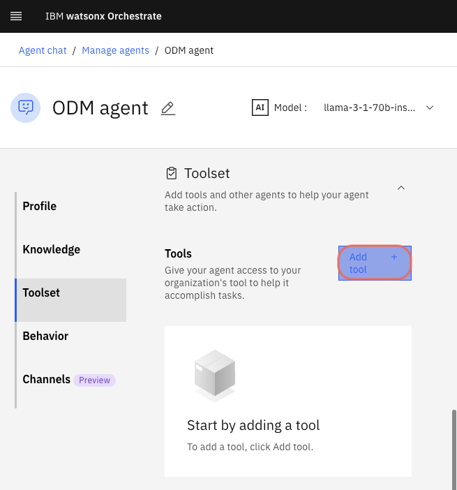

- Click **Import**

   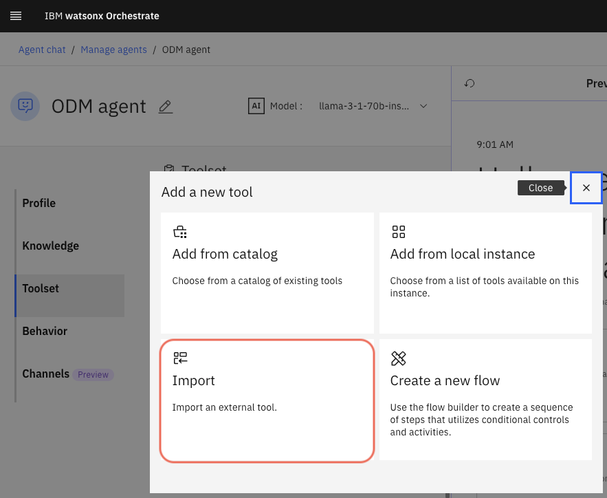

- Click **Import from MCP server**

   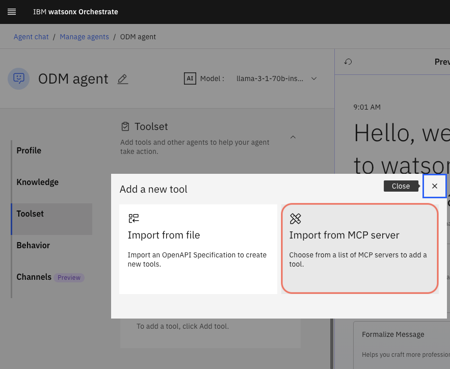

- Click **Add MCP server**

   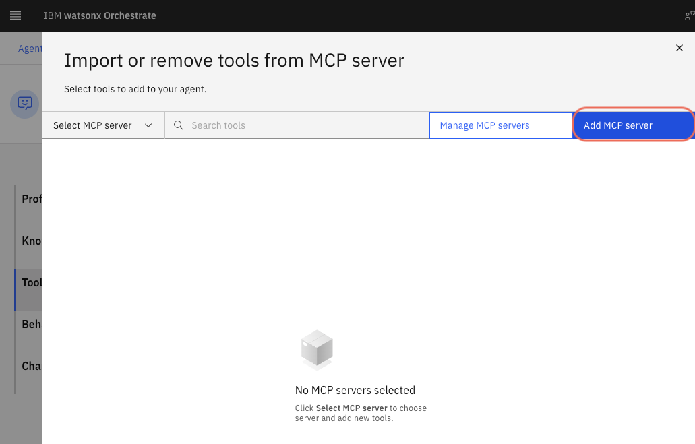

- Enter a **Server name** <u>without any space character</u> eg. `ODM_MCP_Server`
- Optionally enter a **Description** eg. `This MCP Server connects to an ODM Decision Server, enabling to execute the rulesets deployed.`
- Enter an **Install command**
   > Note 1:
   >  - This *Install command* starts the Decision MCP Server
   >  - it begins with `uvx --from git+https://github.com/DecisionsDev/decision-mcp-server.git decision-mcp-server`
   >    followed by :
   >    - `--url <RES_URL>` (where RES_URL is the URL of the ODM RES console where the rulesets to be used as tools are deployed)
   >    - authentication arguments to connect to the ODM RES console (either using basic auth, OpenId, or Zen Api Key)
   >  - For more about those arguments, please refer to [the main README.md (chapter 'ODM Container Environments & Authentication')](../README.md#odm-container-environments--authentication)

   > Note 2:
   >  - Before clicking **Connect**, make sure that the rulesets that should be exposed as tools through the Decision MCP Server, are deployed and configured accordingly using the ruleset parameter `agent.enabled` = `True`, otherwise you need to delete the MCP server and recreate it
   >  - you can deploy the rulesets provided as samples in [`samples`](/samples/). To do so:
   >    - either import [`samples-ruleapp.jar`](/samples/samples-ruleapp.jar) in the RES console directly
   >    - or import the Decision Services [`Beauty Advisory Service`](/samples/Beauty_Advisory_Service.zip) and [`Vacation Service`](/samples/Vacation_Service.zip) in Decision Center and deploy each to the RES console  

- Click **Connect**
- If you should see "Connection successful", click **Done**
- If not, try to modify the Install command and retry. You may need to delete the MCP server beforehand. To do so:
   - Click **Cancel** to go back to the previous step,
   - Click **Manage MCP servers**
   - Select your MCP server and click **Delete** in the menu icon

   

- set the **Activation toggle** to **On** for the tools (rulesets) to be enabled

   

### 3. Deploy the agent

- Click **Deploy**
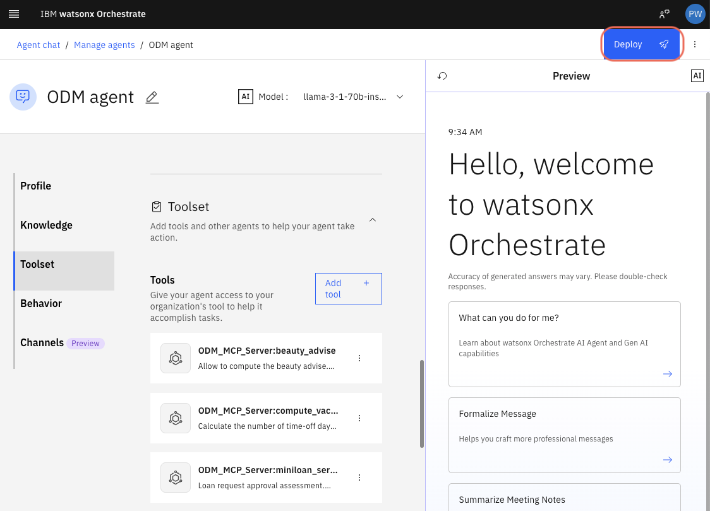

- In the popup, Click **Deploy** again
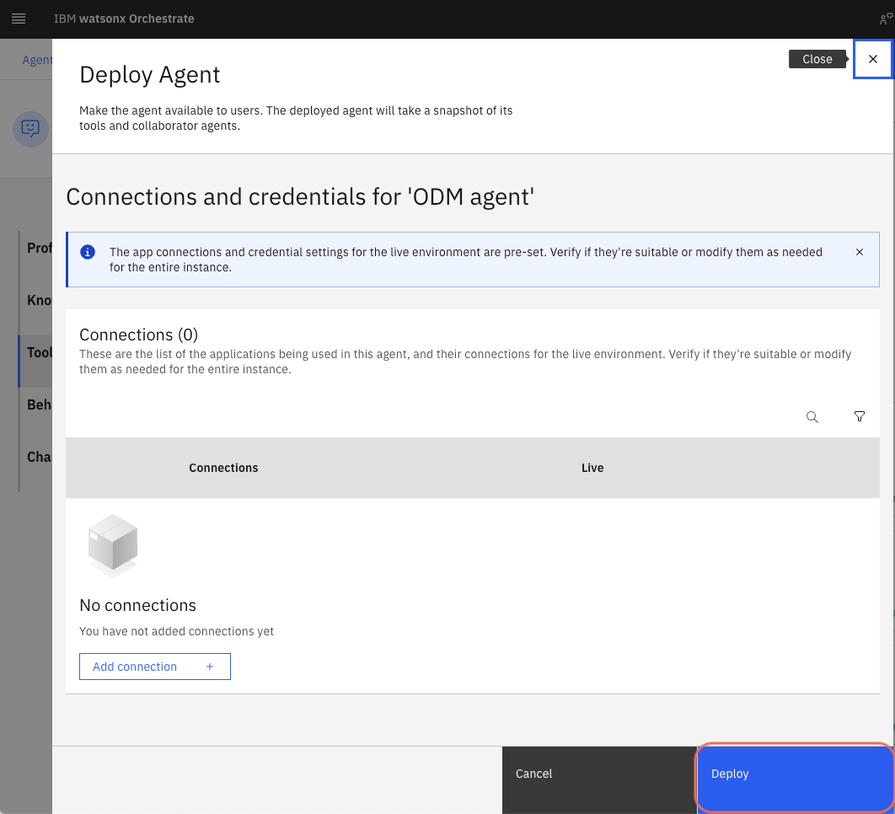

### 4. Let the agent be used in chats

- Click the main menu icon

   

- Navigate to **Chat**

   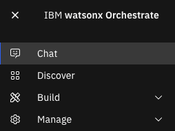

- Click the newly created agent

   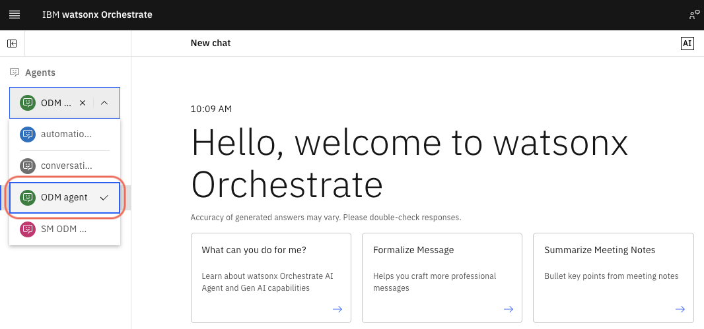

## Example of chat

- For instance, with the ruleset from `Vacation Service` deployed, you can have the following interaction in a chat:

   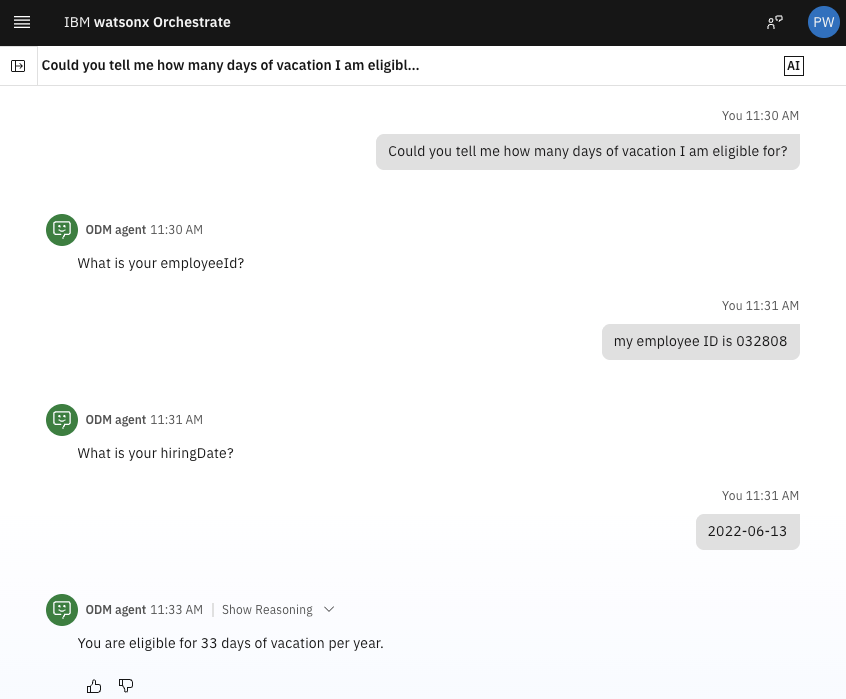

- Click **Show Reasoning** to see the request sent to the ruleset and its response:

   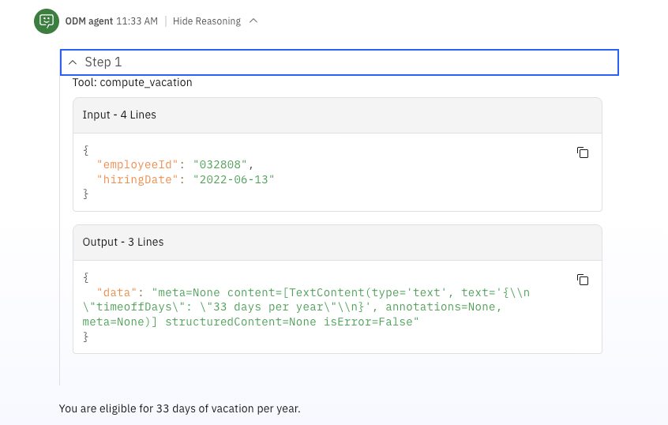

## Help

For more about IBM Watsonx Orchestrate, see [Getting Started](https://www.ibm.com/docs/en/watsonx/watson-orchestrate/base?topic=getting-started-watsonx-orchestrate).